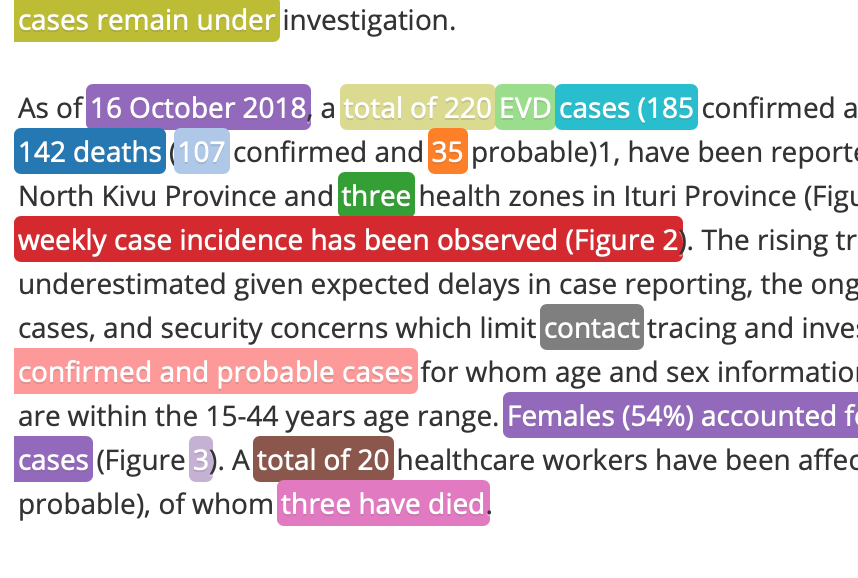
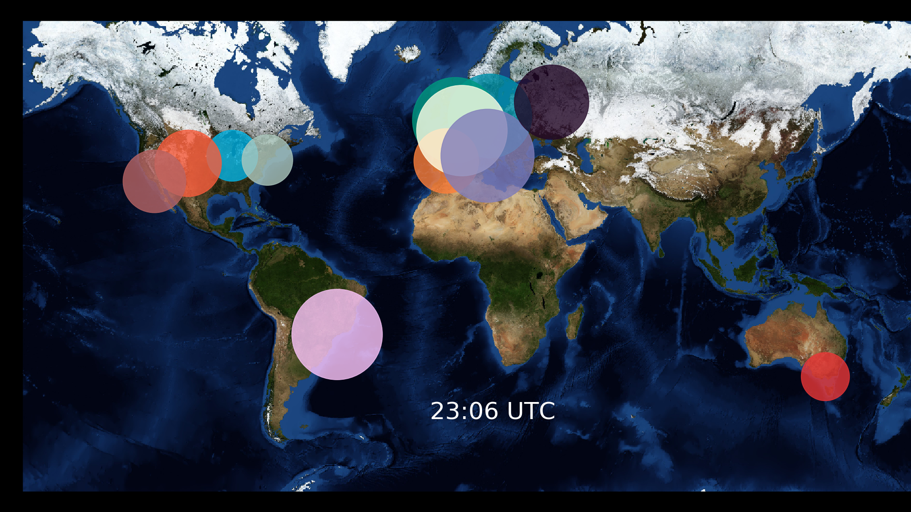
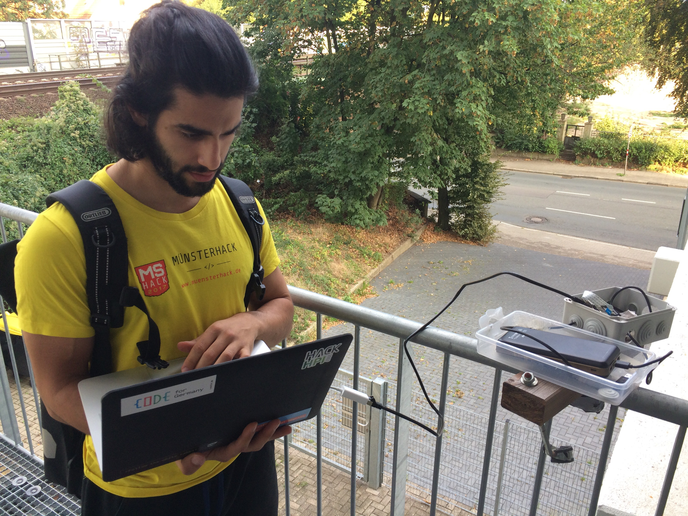
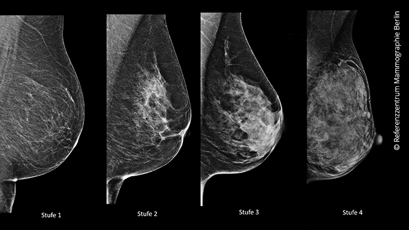
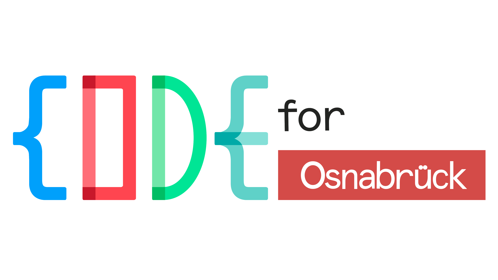
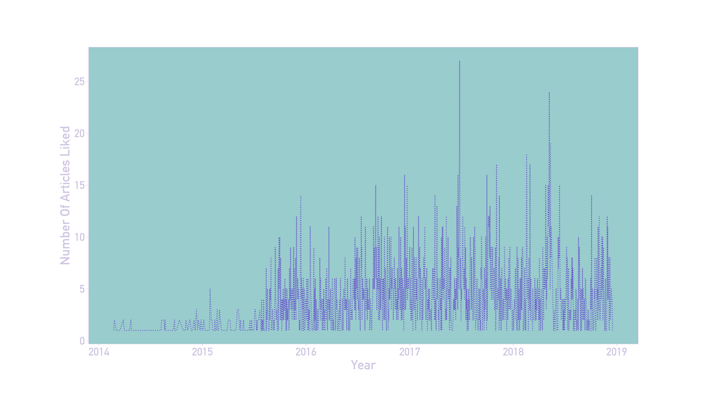
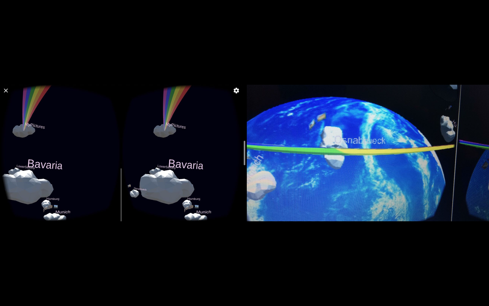

  <h3 class="major" style='max-width:100%'>Natural Language Processing   For Epidemiological Surveillance</h3>
  
  The epidemiological surveillance of the Robert Koch Institute (the public health institute of Germany) is screening outbreak news from several sources on a daily
  basis. These outbreaks need to be analysed and reported to the Minestry Of Health. My project work tries to summarize articles of interest and reduce writing work. Additionally,
  I utilize former decision of the epidemiologists to train a classifier that allows to filter interesting news from the web that are usaually beyond their scope.

  <h3 class="major" style='max-width:100%'>A Timelaps Of The Blizzard Server Activity</h3>
  
  Using an estimate of the people online via CensusPuls UI, I showed the relative server use given people online for the American, Australien, and European World of Wacraft Server. The background image is from a NASA satellite.

  <h3 class="major" style='max-width:100%'>Raspberry Pi Driven Cargo Train Surveillance</h3>
  
  As a study project we used a Raspberry Pi to track cargo train activiy. To count train cars we used computer vision methods and deep learning. Later we built a model to predict company's revenue based on cargo car counts.

  <h3 class="major" style='max-width:100%'>Implementing CapsNet   And Detect Cancer In Mammophray</h3>
  
  We implemented Hinton's CapsNet and used it to classify wether cancer is visible in a mamopgraphy and if so, in which stage it is. We assumed that this neural net might be particulary well suited to detect different stages of breast cancer.
  CapsNet showed the possibility to learn several dimensionalities of style in MNIST data. Therefore, it theoretically could also learn the associate certain shapes to stages of breast cancer.

  <h3 class="major" style='max-width:100%'> Co-found Of The Open Knowledge Lab Osnabrück </h3>
  
  Together with Rüdiger Busche we found the Open Knowledge Lab in Osnabrück. Here, we had got involved with the local data politics. We managed to get the budget plan of the city.
  We cleaned this data and published it to openspending.org. I made a YouTube video explaining the data and how to use the platform. Additionally we played with Kosmo...

  <h3  class="major"> Tumblr-Likes Analysis </h3>
  

  Since I spent so much time browsing Tumblr, I wanted to work with their API. So, I analysed, besides other, my Tumblr consume using the Tumblr API.

  <h3  class="major"> A VR Image Viewer Set In Space </h3>
  

  Although I love playing games and therefore chose a course to learn Unity and gamedevelopment I got fond to explore use cases in VR (virtual reality). With this application I tried to rethink exploring your images. With nothing else then space and your images I was sure one would explore photpgraphy differently.

