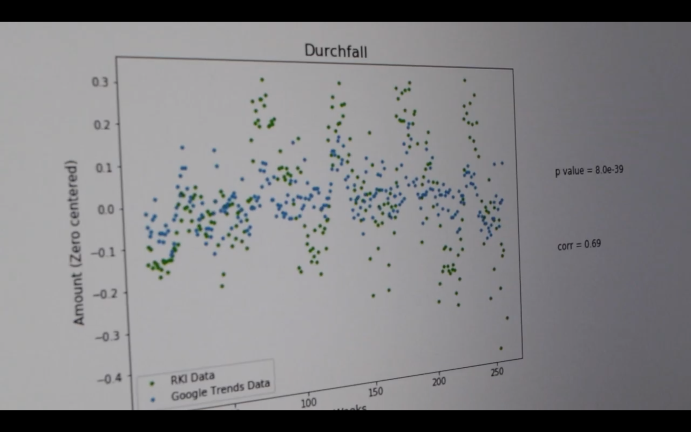

  <h3 class="major" style='max-width:100%'>Natural Language Processing   For Epidemiological Surveillance</h3>
  
  The epidemiological surveillance of the Robert Koch Institute (the public health institute of Germany) is screening outbreak news from several sources on a daily
  basis. These outbreaks need to be analyzed and reported to the Ministry Of Health. My project work tries to summarize articles of interest and reduce writing work. Additionally,
  I utilize the former decision of the epidemiologists to train a classifier that allows filtering interesting news from the web that is usually beyond their scope.

  

  <h3 class="major" style='max-width:100%'>A Timelaps Of The Blizzard Server Activity</h3>
  
  Using an estimate of the people online via CensusPuls UI, I showed the relative server use given people online for the American, Australien, and European World of Warcraft Server. The background image is from a NASA satellite.

  

  <h3 class="major" style='max-width:100%'>Raspberry Pi Driven Cargo Train Surveillance</h3>
  
  As a study project, we used a Raspberry Pi to track cargo train activity. To count train cars we used computer vision methods and deep learning. Later we built a model to predict a company's revenue based on cargo car counts.

  

  <h3 class="major" style='max-width:100%'>Implementing CapsNet   And Detect Cancer In Mammophray</h3>
  
  We implemented Hinton's CapsNet and used it to classify whether cancer is visible in mammography and if so, in which stage it is. We assumed that this neural net might be particularly well suited to detect different stages of breast cancer.
  CapsNet showed the possibility to learn several dimensionalities of style in MNIST data. Therefore, it theoretically could also learn the associate certain shapes to stages of breast cancer.

  

  <h3 class="major" style='max-width:100%'>AR Bus Arrival Board And Delay Prediction </h3>
  
  At the Münsterhack 2017, we developed an AR arrival board to allow users the display of real-time updated arrival times of busses. Instead of looking at the timetable of the bus station, users are able to just view the arrival times including delays, current traffic information, and other information.
  Besides, we used the available data to find departure times of the bus lines that are particularly prone to delay. Therefore we used random forests, bus arrival/departure/delay data of the last year, weather, and holiday/event data. We were able to predict in average 2 minutes of all delays that happened.
  <a href="https://www.youtube.com/watch?v=vgbBKbQQlXQ"> Here </a> is a link of our app.

  

  <h3 class="major" style='max-width:100%'> Virtual Assistant For Outbreak Detection Informed By Data Of The Public Health Institute And Google Trends</h3>
  
  We got the opportunity to work with curated data of the Robert Koch Institute, the public health institute of Germany. This data included symptomatic data of reported cases over the past five years. We trained a classifier that returned a probability distribution of disease given symptoms.
  Together with reported cases by physicians and citizen to the app, we are able to stack this information and report an emerging outbreak. Physicians and citizen gain more insights into local emerging outbreaks for reporting their observations/symptoms. To enrich the data, we also included
  Google Trends data for symptoms that correlated well with reported symptoms of the public health institute. Watch <a href="https://www.youtube.com/watch?v=Cg3RnAeExGo"> this </a> for an example (German).

  

  <h3 class="major" style='max-width:100%'> Co-found Of The Open Knowledge Lab Osnabrück </h3>
  
  Together with Rüdiger Busche, we found the Open Knowledge Lab in Osnabrück. Here, we had got involved with the local data politics. We managed to get the budget plan of the city.
  We cleaned this data and published it to openspending.org. I made a YouTube video explaining the data and how to use the platform.

  

  <h3  class="major"> Tumblr-Likes Analysis </h3>
  

  Since I spent so much time browsing Tumblr, I wanted to work with their API. So, I analyzed, besides others, my Tumblr consume using their API.

  

  <h3  class="major"> A VR Image Viewer Set In Space </h3>
  

  Although I love playing games and therefore chose a course to learn Unity and game development I got fond to explore use cases in VR (virtual reality). With this application, I tried to rethink exploring your images. With nothing else than space and your images, I was sure one would explore photography differently.

